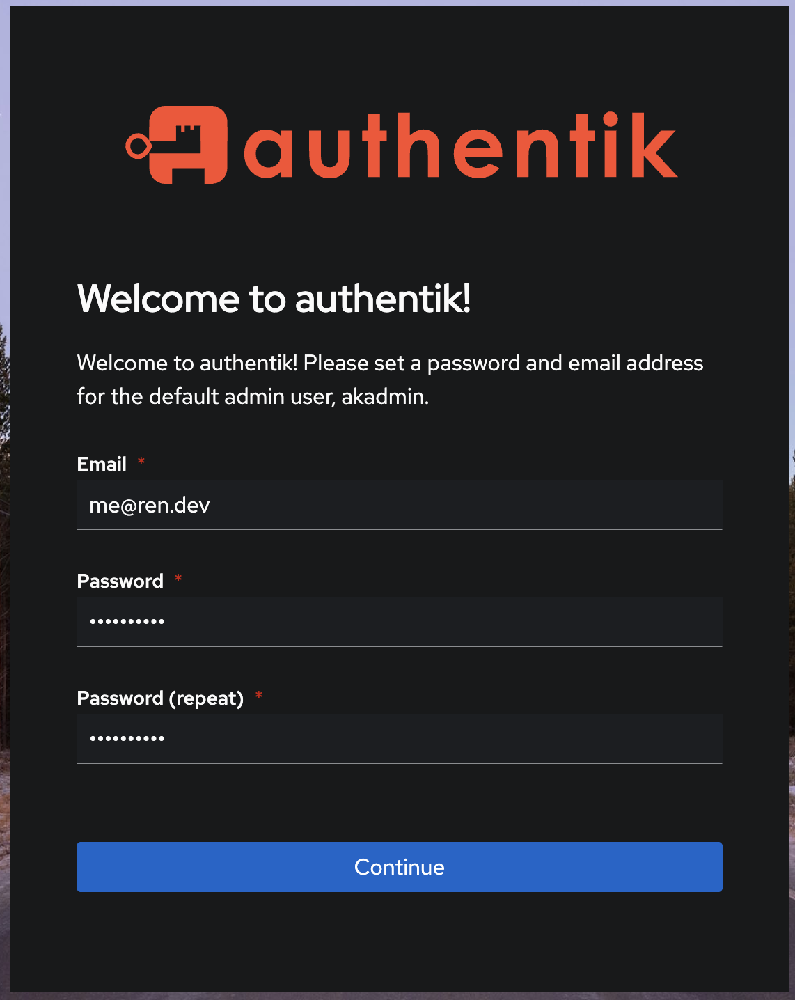

# Configuration d’Authentik

Instructions de déploiement et de configuration pour un environnement local.

Objectifs :

- Déploiement via Docker Compose
- Ajout d’un formulaire d’inscription pour FreeHunt

# 1. Installation via Docker Compose

Référence : [documentation officielle](https://docs.goauthentik.io/docs/install-config/install/docker-compose)

## a. Fichier `compose.yaml`

A insérer à la racine du projet

```yaml
services:
  postgresql:
    image: docker.io/library/postgres:16-alpine
    container_name: authentik-postgresql
    healthcheck:
      test: ["CMD-SHELL", "pg_isready -d $${POSTGRES_DB} -U $${POSTGRES_USER}"]
      start_period: 20s
      interval: 30s
      retries: 5
      timeout: 5s
    volumes:
      - database:/var/lib/postgresql/data
    environment:
      POSTGRES_PASSWORD: ${PG_PASS:?database password required}
      POSTGRES_USER: ${PG_USER:-authentik}
      POSTGRES_DB: ${PG_DB:-authentik}
    env_file:
      - .env

  redis:
    image: docker.io/library/redis:alpine
    container_name: authentik-redis
    command: --save 60 1 --loglevel warning
    restart: unless-stopped
    healthcheck:
      test: ["CMD-SHELL", "redis-cli ping | grep PONG"]
      start_period: 20s
      interval: 30s
      retries: 5
      timeout: 3s
    volumes:
      - redis:/data

  server:
    image: ${AUTHENTIK_IMAGE:-ghcr.io/goauthentik/server}:${AUTHENTIK_TAG:-2025.2.3}
    container_name: authentik-server
    restart: unless-stopped
    command: server
    environment:
      AUTHENTIK_REDIS__HOST: redis
      AUTHENTIK_POSTGRESQL__HOST: postgresql
      AUTHENTIK_POSTGRESQL__USER: ${PG_USER:-authentik}
      AUTHENTIK_POSTGRESQL__NAME: ${PG_DB:-authentik}
      AUTHENTIK_POSTGRESQL__PASSWORD: ${PG_PASS}
    volumes:
      - ./media:/media
      - ./custom-templates:/templates
    env_file:
      - .env
    ports:
      - "${COMPOSE_PORT_HTTP:-9000}:9000"
      - "${COMPOSE_PORT_HTTPS:-9443}:9443"
    depends_on:
      postgresql:
        condition: service_healthy
      redis:
        condition: service_healthy

  worker:
    image: ${AUTHENTIK_IMAGE:-ghcr.io/goauthentik/server}:${AUTHENTIK_TAG:-2025.2.3}
    container_name: authentik-worker
    restart: unless-stopped
    command: worker
    environment:
      AUTHENTIK_REDIS__HOST: redis
      AUTHENTIK_POSTGRESQL__HOST: postgresql
      AUTHENTIK_POSTGRESQL__USER: ${PG_USER:-authentik}
      AUTHENTIK_POSTGRESQL__NAME: ${PG_DB:-authentik}
      AUTHENTIK_POSTGRESQL__PASSWORD: ${PG_PASS}
    user: root
    volumes:
      - /var/run/docker.sock:/var/run/docker.sock
      - ./media:/media
      - ./certs:/certs
      - ./custom-templates:/templates
    env_file:
      - .env
    depends_on:
      postgresql:
        condition: service_healthy
      redis:
        condition: service_healthy

volumes:
  database:
  redis:
```

Ou générer le compose.yml avec le code suivant :

```jsx
curl -O https://goauthentik.io/docker-compose.yml
```

## b. Variables d’environnement

Exécutez ces 2 commandes dans le terminale pour la génération de vos variables d’environnement (vérifier en premier lieu si elles n’existent pas déjà dans le fichier)

```bash
echo "PG_PASS=$(openssl rand -base64 36 | tr -d '\n')" >> .env
echo "AUTHENTIK_SECRET_KEY=$(openssl rand -base64 60 | tr -d '\n')" >> .env
```

## c. Exécution

Le démarrage initial prend généralement une minute ou deux, le temps pour Authentik d’initialiser sa base de données et d’exécuter toutes ses migrations (surveiller les logs avec `docker compose logs -f`).

```bash
docker compose up -d
```

# 2. Création du compte administrateur

1. Se rendre sur [http://localhost:9000/if/flow/initial-setup/](http://localhost:9000/if/flow/initial-setup/)
1. Saisir l’adresse mail et le mot de passe du compte administrateur à créer



<aside>
💡

Aucun mail de confirmation n’est envoyé à l’adresse saisie, donc pourquoi pas utiliser une adresse courte pour pouvoir se connecter rapidement (ou alors se connecter avec le nom d’utilisateur du compte qui est `akadmin`)

</aside>

# 3. Configuration du flow d’authentification pour FreeHunt

Se rendre sur l’interface administrateur en cliquant sur le bouton ci-dessous ou via le lien suivant [http://localhost:9000/if/admin/#/administration/overview](http://localhost:9000/if/admin/#/administration/overview)


<aside>
⚠️

Optionnel : cliquer sur `Settings` une fois dans l’interface administrateur pour passer en anglais pour la suite du tutoriel, sinon GLHF (ça entraine pour le TOEIC)


</aside>

## a. Création du groupe d’utilisateurs

Sous `Directory > Groups`, créer un groupe appelé `FreeHunt`. Laisser les autres valeurs par défaut.

Ce groupe accueillera tous les utilisateurs qui s’inscrivent sur notre site.


## b. Création du flow d’inscription

Par défaut, Authentik ne propose qu’un formulaire de connexion sans possibilité d’inscription.

Nous allons donc créer un _flow_, c’est-à-dire un ensemble de formulaires successifs, pour l’inscription de nos utilisateurs et le rattacher au formulaire de connexion existant.

Pour commencer, sous `Flows and Stages > Flows`, cliquer sur `Create`.


Remplir les champs comme suit :

- Name: `FreeHunt Enrollment`
- Title: `FreeHunt`
- Slug: `freehunt-enrollment`
- Designation: `Enrollment`
- Authentication: `No requirement`

Optionnel :

- Sous `Behavior settings` , cocher `Compatibility mode` pour rendre les inputs compatibles avec les gestionnaires de mot de passe (fonctionne plus ou moins bien d’un gestionnaire à l’autre)

Puis cliquer sur le bouton `Create` pour créer le flow.

## c. Configuration du flow d’inscription

Dans la liste des flows, cliquer sur le flow `freehunt-enrollment` nouvellement créé.

Nous allons maintenant ajouter des étapes – ou formulaires – à notre processus d’inscription.

Pour ce faire, se rendre dans l’onglet `Stage Bindings` .


Ajouter successivement chacun des deux _stages_ suivants en cliquant sur `Bind existing stage` (laisser tous les autres champs par défaut) :

```
- Stage: default-source-enrollment-prompt
- Order: 0

- Stage: default-source-enrollment-write
- Order: 1
```

Cliquer sur le bouton `Edit Stage` associé au stage `default-source-enrollment-prompt`.


Sous `Stage-specific settings > Fields` , ajouter les champs suivants de manière à ce qu’ils apparaissent dans la colonne `Selected Fields` :

- `default-user-settings-field-email`
- `default-password-change-field-password`
- `default-password-change-field-password-repeat`


<aside>
⚠️

Laisser le champ `default-source-enrollment-field-username` déjà ajouté par défaut.

</aside>

De même, sous `Stage-specific settings > Validation Policies`, on se propose d’ajouter `default-password-change-password-policy (Password Policy)` pour imposer des règles de sécurité minimales sur les mots de passe acceptés.

Une fois les changements effectués, cliquer sur le bouton `Update` pour les sauvegarder.

À présent, cliquer sur le bouton `Edit Stage` associé au stage `default-source-enrollment-write`.


Sous `Group`, sélectionner le groupe `FreeHunt` précédemment créé.


Notons que, par défaut, les deux paramètres suivants sous `Stage-specific settings` sont considérés de la sorte :

- Create users as inactive: `off` (cela veut dire que les utilisateurs qui s’inscriront seront immédiatement actifs et pourront utiliser le site, alors que l’on pourrait introduire une étape intermédiaire comme une validation par mail via Authentik, par exemple.
- User Type: `External` , ce qui signifie que les utilisateurs créés au moyen de ce formulaire sont externes à Authentik (tandis que le compte admin depuis lequel nous exécutons ces actions est interne, par exemple).

Une fois le changement effectué, cliquer sur le bouton `Update` pour le sauvegarder.

## d. Ajout du flow d’inscription au flow d’authentification par défaut

Enfin, il convient d’ajouter notre flow d’inscription au flow d’authentification par défaut d’Authentik, afin qu’une option pour créer un compte s’affiche en bas du formulaire de connexion.

Pour ce faire, sous `Flows and Stages > Flows`, cliquer sur `default-authentication-flow`.

Dans l’onglet `Stage Bindings`, cliquer sur le bouton `Edit Stage` associé à `default-authentication-identification`.

Sous `Flow settings > Enrollment flow` (défiler en bas pour voir cette section), sélectionner le _flow_ nouvellement créé.


Puis sauvegarder les changements.

# 4. Test de l’inscription

En se rendant à l’adresse [http://localhost:9000](http://localhost:9000) en navigation privée ou depuis un autre navigateur (pour ne pas être déjà connecté au compte administrateur), on voit maintenant apparaître la mention `Need an account? Sign up.` en bas du formulaire de connexion.


En cliquant sur le lien `Sign up`, notre formulaire d’inscription apparaît avec les différents champs que nous avons sélectionnés plus haut (nom d’utilisateur, adresse mail, mot de passe et confirmation du mot de passe).


Après avoir soumis le formulaire d’inscription, nous sommes redirigés vers le formulaire de connexion, ce qui est le comportement attendu au regard de notre configuration (voir [5. Remarques](https://www.notion.so/5-Remarques-1cf11d4f9f2a80cc91a9edae804e8ed2?pvs=21) ).

Nous pouvons confirmer que l’utilisateur a bien été créé en retournant sur l’interface administrateur d’Authentik, sous `Directory > Users`.


<aside>
⚠️

Pour le bon fonctionnement d’Authentik sur FreeHunt via API, bien veiller à sélectionner `default-authentication-password` en tant que _Password stage_ dans _Stages_ > _default-authentication-identification_


</aside>

# 5. Remarques

- Cette configuration n'est actuellement pas compatible avec NestJS + OIDC ; elle permet uniquement d'ajouter le processus d'inscription au formulaire.
- Cette configuration réutilise les _flows_ et les _stages_ existants plutôt que d'en créer des dédiés pour FreeHunt. Pour un environnement de production, il serait peut-être préférable de les séparer.
- Il faut considérer Authentik comme une solution d'authentification centralisée vers laquelle les applications délèguent à la fois l'authentification des utilisateurs et la sécurisation des connexions.
  - Pour notre projet, seule FreeHunt sera intégrée à notre configuration Authentik. Cependant, dans un réel contexte d'entreprise, nous pourrions connecter toutes nos applications (Slack, Teams, Google, Microsoft, GitHub, Figma…) à Authentik pour permettre à nos employés de se connecter avec une seule paire d’identifiants adresse mail + mot de passe – c'est le principe du Single Sign-On (SSO).
  - En SaaS, Okta, Microsoft Entra ID et Auth0 figurent parmi les solutions SSO d'entreprise les plus populaires.

# 6. Pour aller plus loin

- Configuration d’un Provider OIDC pour FreeHunt.
  - Nécessite d’utiliser une bibliothèque comme https://www.npmjs.com/package/oidc-client-ts côté NestJS et de créer une application + un OIDC provider pour FreeHunt côté Authentik.
  - Il faudra configurer notre flow d’inscription et de connexion de telle sorte que les utilisateurs seront redirigés sur FreeHunt après s’être connectés sur Authentik.
- Authentification avec Discord via la [documentation](https://docs.goauthentik.io/docs/users-sources/sources/social-logins/discord/).
- Créer une `Brand` sous `System > Brands` pour changer le titre de la page, le favicon ou encore le logo du formulaire.
