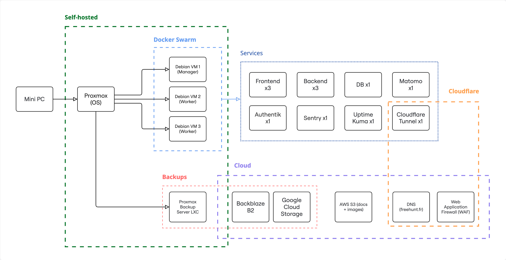
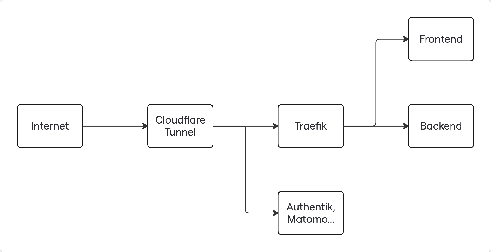
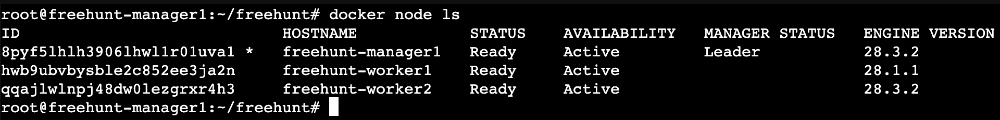
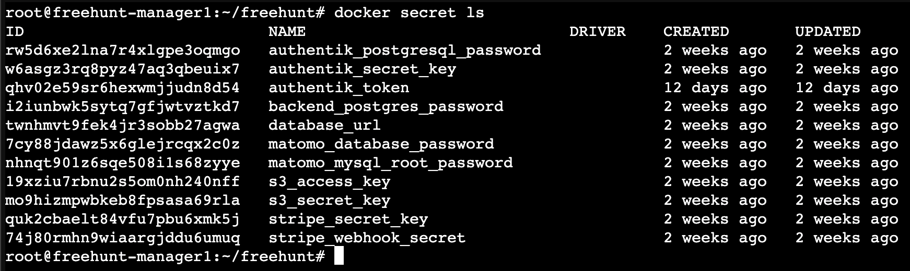
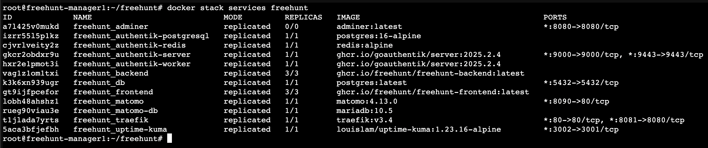

# Déploiement de FreeHunt sur cluster Docker Swarm

## 1. Vue d'ensemble du système

### Architecture applicative

FreeHunt est une plateforme de freelance complète déployée en architecture microservices sur Docker Swarm. Le système comprend les composants suivants :



### Services composant FreeHunt

- **Frontend** : Application Next.js pour l'interface utilisateur
- **Backend** : API NestJS avec support WebSocket (Socket.IO) pour la messagerie temps réel
- **Load balancer** : Traefik pour la répartition de charge avec sticky sessions
- **Base de données** : PostgreSQL pour les données applicatives
- **Authentification** : Authentik pour la gestion des utilisateurs et SSO
- **Analytics** : Matomo pour le suivi des utilisations
- **Monitoring** : Uptime Kuma pour la surveillance des services
- **Stockage** : AWS S3 pour les fichiers et avatars
- **Paiement** : Intégration Stripe pour les transactions

### Prérequis système

**Configuration matérielle recommandée :**

- Minimum 3 machines (1 manager + 2 workers) connectées au même réseau
- 4 Go de RAM par machine minimum
- 2 cœurs de CPU par machine minimum
- 50 Go d'espace disque par machine minimum

**Logiciels requis :**

- Docker installé sur chaque machine
- Nom de domaine configuré

**Architecture du cluster :**

L'application est conçue pour la haute disponibilité avec :

- Services applicatifs répliqués sur plusieurs noeuds
- Load balancer Traefik pour la répartition intelligente des charges
- Mises à jour progressives avec rollback automatique

## 2. Architecture réseau et exposition

### Diagramme d'exposition des services



Cette stack a été déployée en utilisant Cloudflare Tunnel, mais il est possible d'utiliser d'autres services comme Pangolin ou un reverse proxy externe pour atteindre un résultat similaire.

### Configuration DNS et domaines

Configurer les enregistrements DNS pour pointer vers le cluster :

```
A    votre-domaine.com             -> IP-DU-CLUSTER
A    www.votre-domaine.com         -> IP-DU-CLUSTER
A    api.votre-domaine.com         -> IP-DU-CLUSTER
A    socket.votre-domaine.com      -> IP-DU-CLUSTER
A    authentik.votre-domaine.com   -> IP-DU-CLUSTER
A    matomo.votre-domaine.com      -> IP-DU-CLUSTER
A    uptime.votre-domaine.com      -> IP-DU-CLUSTER
A    traefik.votre-domaine.com     -> IP-DU-CLUSTER
```

### Ports exposés

Les services suivants sont accessibles depuis l'extérieur :

- **Port 80** : Traefik load balancer (point d'entrée pour le frontend et le backend)
- **Port 8081** : Dashboard Traefik (`traefik.votre-domaine.com`)
- **Port 9000** : Authentik (`authentik.votre-domaine.com`)
- **Port 8090** : Matomo (`matomo.votre-domaine.com`)
- **Port 3002** : Uptime Kuma (`uptime.votre-domaine.com`)

**Note importante** : Avec Traefik, les services frontend et backend ne sont plus exposés directement. Tout passe par le load balancer sur le port 80, qui route les requêtes selon les domaines configurés :
- `votre-domaine.com` et `www.votre-domaine.com` → Frontend (port interne 5173)
- `api.votre-domaine.com` → Backend API (port interne 3000)
- `socket.votre-domaine.com` → Backend WebSocket (port interne 3001)

### Stratégie de load balancing avec Traefik

Traefik est configuré spécifiquement pour gérer le frontend et le backend avec :

- Dashboard d'administration accessible via le port 8081
- Découverte automatique des services Docker Swarm
- Support des labels pour le routage intelligent
- Sticky sessions pour Socket.IO (sous-domaine `socket.votre-domaine.com`)

Le fichier `traefik/traefik.yml` configure ces fonctionnalités pour assurer le bon fonctionnement des WebSockets utilisés par la messagerie en temps réel.

## 3. Préparation de l'infrastructure

### Initialisation du cluster Docker Swarm

**Initialisation du manager :**

Sur la machine qui sera le noeud manager :

```bash
# Initialiser le swarm (remplacez par votre IP)
docker swarm init

# Récupérer le token pour les workers
docker swarm join-token worker
```

**Ajout des noeuds workers :**

Sur chaque machine worker, exécuter la commande fournie par `join-token` :

```bash
docker swarm join --token <TOKEN> <MANAGER-IP>:2377
```

**Vérification du cluster :**

```bash
# Vérifier l'état du cluster
docker node ls
```



### Gestion des secrets Docker Swarm

**Liste des secrets requis :**

L'application nécessite 10 secrets pour fonctionner en production :

```bash
# Secrets backend
echo "postgresql://freehunt:<mot-de-passe>@db:5432/freehunt" | docker secret create database_url -
echo "<mot-de-passe-postgres>" | docker secret create backend_postgres_password -

# Secrets Authentik
echo "<mot-de-passe-authentik-db>" | docker secret create authentik_postgresql_password -
echo "<clé-secrète-authentik-64-chars>" | docker secret create authentik_secret_key -

# Secrets Matomo
echo "<mot-de-passe-matomo-db>" | docker secret create matomo_database_password -
echo "<mot-de-passe-root-mysql>" | docker secret create matomo_mysql_root_password -

# Secrets S3
echo "<access-key-s3>" | docker secret create s3_access_key -
echo "<secret-key-s3>" | docker secret create s3_secret_key -

# Secrets Stripe
echo "<stripe-secret-key>" | docker secret create stripe_secret_key -
echo "<stripe-webhook-secret>" | docker secret create stripe_webhook_secret -
```

**Génération de mots de passe sécurisés :**

```bash
# Générer un mot de passe aléatoire
openssl rand -base64 32

# Générer la clé secrète Authentik (60 caractères)
openssl rand -base64 60
```

**Vérification des secrets :**

```bash
docker secret ls
```



### Configuration des services externes

**AWS S3 :**

Prérequis :

- Bucket S3 créé et configuré
- Utilisateur IAM avec accès au bucket
- Politique CORS configurée pour votre domaine

Variables nécessaires (à inclure dans les secrets) :

- `S3_ACCESS_KEY` : Clé d'accès IAM
- `S3_SECRET_KEY` : Clé secrète IAM
- `S3_URL` : URL du endpoint S3 (ex: `https://s3.amazonaws.com`)

**Stripe :**

Prérequis :

- Compte Stripe configuré
- Webhook configuré pointant vers `https://votre-domaine.com/stripe/webhook`

Secrets nécessaires :

- `STRIPE_SECRET_KEY` : Clé secrète Stripe (commence par `sk_`)
- `STRIPE_WEBHOOK_SECRET` : Secret du webhook Stripe

**Bases de données :**

Les bases de données PostgreSQL et MariaDB sont gérées directement par Docker Swarm. Les mots de passe sont fournis via les secrets configurés précédemment.

## 4. Configuration et déploiement

### Préparation du projet

**Récupération du code source :**

```bash
# Cloner le repository
git clone https://github.com/FreeHunt/freehunt.git
cd freehunt
```

**Structure des fichiers de configuration :**

Le projet utilise plusieurs fichiers Docker Compose :

- `compose.yaml` : Services de base (développement et production)
- `compose.prod.yaml` : Surcharges pour la production (réplication, secrets)
- `compose.dev.yaml` : Services spécifiques au développement (non utilisé en production)

La configuration de production combine `compose.yaml` + `compose.prod.yaml`.

### Variables d'environnement

**Images Docker pré-construites :**

L'application utilise les images officielles hébergées sur GitHub Container Registry :

- `ghcr.io/freehunt/freehunt-frontend:latest`
- `ghcr.io/freehunt/freehunt-backend:latest`

Ces images sont spécifiées dans `compose.prod.yaml`.

**Variables d'environnement du frontend :**

Dans le Dockerfile du frontend, modifiez les `ARG` selon vos besoins :

```dockerfile
ARG NEXT_PUBLIC_API_URL=https://api.votre-domaine.com
ARG NEXT_PUBLIC_MATOMO_URL=https://matomo.votre-domaine.com
ARG NEXT_PUBLIC_MATOMO_SITE_ID=1
ARG NEXT_PUBLIC_SOCKET_URL=https://socket.votre-domaine.com
```

**Variables d'environnement du backend :**

Dans le Dockerfile du backend :

```dockerfile
ARG AUTHENTIK_URL=https://authentik.votre-domaine.com
ARG FRONTEND_URL=https://votre-domaine.com
ARG S3_URL=https://s3.amazonaws.com
```

**Note** : Avec Traefik, les WebSockets utilisent un sous-domaine dédié (`socket.votre-domaine.com`) pour bénéficier des sticky sessions nécessaires au bon fonctionnement de Socket.IO.

### Déploiement de la stack

**Commande de déploiement :**

```bash
# Déployer la stack complète
docker stack deploy -c compose.yaml -c compose.prod.yaml freehunt
```

**Vérification du déploiement :**

```bash
# Vérifier l'état des services
docker stack services freehunt

# Vérifier les détails d'un service spécifique
docker service ps freehunt_frontend
docker service ps freehunt_backend

# Consulter les logs d'un service
docker service logs freehunt_frontend
```



### Validation

**Disponibilité :**

Le déploiement complet peut prendre quelques minutes. Les services dépendants (bases de données) doivent être prêts avant les services applicatifs.  
Docker Swarm redémarre les services "en boucle" jusqu'à atteindre un état stable.

**Résultat attendu :**

Une fois configuré, les services doivent être accessibles via HTTPS sur leurs domaines respectifs avec des certificats SSL valides.

## 5. Production et exploitation

### Stratégies de haute disponibilité et réplication

**Services applicatifs critiques :**

- **Frontend** : 3 répliques réparties sur les noeuds disponibles
- **Backend** : 3 répliques réparties sur les noeuds disponibles
- **Load balancer Traefik** : 1 réplique sur noeud manager avec sticky sessions pour Socket.IO

**Bases de données centralisées :**

- **PostgreSQL (principal)** : 1 réplique sur noeud manager uniquement
- **PostgreSQL (Authentik)** : 1 réplique sur noeud manager uniquement
- **MariaDB (Matomo)** : 1 réplique sur noeud manager uniquement
- **Redis (Authentik)** : 1 réplique sur noeud manager uniquement

Ceci permet de ne pas se soucier du partage des volumes aux différents noeuds qui composent le cluster.

### Scaling et ajustement des ressources

**Modification du nombre de répliques :**

```bash
# Augmenter le nombre de répliques du frontend
docker service scale freehunt_frontend=5

# Réduire le nombre de répliques du backend
docker service scale freehunt_backend=2

# Vérifier les changements
docker service ls
```

**Modification des limites de ressources :**

Pour ajuster les ressources, modifier `compose.prod.yaml` puis redéployer :

```yaml
deploy:
  replicas: 3
  resources:
    reservations:
      memory: 512M # Augmenté de 256M à 512M
      cpus: "0.5" # Augmenté de 0.25 à 0.5
    limits:
      memory: 1G # Augmenté de 512M à 1G
      cpus: "1.0" # Augmenté de 0.5 à 1.0
```

Puis redéployer :

```bash
docker stack deploy -c compose.yaml -c compose.prod.yaml freehunt
```

### Tolérance aux pannes et rollback automatique

**Mécanismes de rollback automatique :**

Chaque service est configuré avec une politique de mise à jour progressive :

```yaml
update_config:
  parallelism: 1 # Une réplique à la fois
  delay: 10s # Délai entre les mises à jour
  monitor: 30s # Surveillance post-déploiement
  failure_action: rollback # Rollback automatique en cas d'échec
  max_failure_ratio: 0.3 # Seuil d'échec acceptable
```

**Gestion des ressources :**

Chaque service a des limites configurées pour éviter la saturation :

```yaml
resources:
  reservations: # Ressources garanties pour les services critiques
    memory: 256M
    cpus: "0.25"
  limits: # Limites maximales autorisées
    memory: 512M
    cpus: "0.5"
```

**Note** : Les réservations de ressources ne s'appliquent qu'aux services critiques (frontend et backend), tandis que les limites protègent l'ensemble du système contre la surconsommation.
