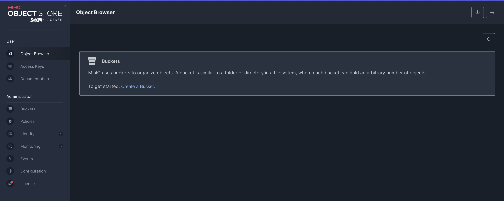

# Configuration de MinIO

Mise en place Minio

Introductions de déploiement et de configuration pour un déploiement local.

MinIO est un serveur de stockage d'objets compatible avec Amazon S3, qui peut être très utile pour des environnements de développement locaux.

Objectifs :

- Comprendre le Docker Compose
- Connexion à Minio
- Création d’un Bucket

# 1. Comprendre le Docker Compose

## a. Fichier `compose.yaml`

```yaml
minio:
  image: minio/minio
  container_name: minio
  restart: unless-stopped
  ports:
    - "10000:9000"
    - "10001:10000"
  volumes:
    - minio-data:/data
  environment:
    MINIO_ROOT_USER: ${MINIO_ROOT_USER:-minioadmin}
    MINIO_ROOT_PASSWORD: ${MINIO_ROOT_PASSWORD:-minioadmin}
  command: server /data --console-address ":10000"
```

- **Ports**:
  - `10000:9000` - expose l'API S3 de MinIO sur le port 10000 de la machine hôte
  - `10001:10000` - expose l'interface web d'administration sur le port 10001 de la machine hôte
- **Volumes**:
  - `minio-data:/data` - stocke les données persistantes dans un volume Docker nommé
- **Variables d'environnement**:
  - `MINIO_ROOT_USER`: nom d'utilisateur administrateur (valeur par défaut: minioadmin)
  - `MINIO_ROOT_PASSWORD`: mot de passe administrateur (valeur par défaut: minioadmin)
- **Commande**: `server /data --console-address ":10000"` - démarre le serveur MinIO avec les données stockées dans `/data` et l'interface d'administration accessible sur le port 10000 (interne au conteneur)

## b. Variables d’environnement dans le dossier Backend

```bash
MINIO_ACCESS_KEY=
MINIO_SECRET_KEY=
MINIO_URL=http://localhost:10000
```

L’API de MinIo est accessible via le port **10000**, c’est pourquoi nous le spécifions dans les variables d’environnement afin de le réutiliser facilement pour nos requêtes vers MinIo.

Les variables **MINIO_ACCESS_KEY** et **MINIO_SECRET_KEY** correspondent aux identifiants qui nous permettront d’interagir avec l’API de MinIo.

Nous allons les générer dans un instant.

# 2. Connexion à Minio

Accédez à l’interface d’administration en cliquant sur le lien suivant :

👉 [http://localhost:10001/login](http://localhost:10001/login)

Les identifiants par défaut sont les suivants :

- **Nom d’utilisateur** : `minioadmin`
- **Mot de passe** : `minioadmin`



Vous arrivez alors sur une page contenant plusieurs sections de l’interface d’administration de Minio.

Ce qui va nous intéresser dans un premier temps, c’est le premier onglet : **Object Browser**.

Dans cet onglet, il nous est proposé de créer un **bucket** — c’est-à-dire un conteneur dans lequel nous allons pouvoir stocker nos fichiers.


Nous allons commencer par créer un bucket nommé **`avatar`**, qui sera **public**. Il servira à héberger les photos de profil des entreprises et des utilisateurs.

Plus tard, nous créerons également un bucket nommé **`document`**, destiné au stockage de documents **privés**.

L’accès à ces documents se fera via des **liens temporaires sécurisés**, générés dynamiquement pour garantir leur confidentialité.


Lorsqu’on clique sur un bucket, on accède à différentes informations le concernant, notamment la **politique d’accès** (_Access Policy_), que nous allons définir sur **Public** pour le bucket `avatar`.

D'autres options sont également disponibles, bien que nous ne les détaillerons pas ici. Elles peuvent être utiles pour des cas d’usage spécifiques, comme :

- attribuer des **droits d’accès par rôle**, que l’utilisateur soit connecté ou anonyme,
- activer la **réplication de buckets**,
- mettre en place une **encryption (chiffrement)** des données,
- ou encore définir un **quota** de stockage pour limiter l’espace utilisé.

Une fois cela fait, nous allons nous rendre dans l’onglet **Access Keys** afin de générer nos identifiants d’accès à l’API.


Ces identifiants seront stockés dans le fichier **.env** de notre backend, afin que le serveur **NestJS** puisse les lire et les utiliser pour interagir avec l’API de MinIO.

⚠️ **Attention :** Les clés ne seront affichées qu’une seule fois. Pensez à bien les conserver immédiatement, car il ne sera plus possible de les visualiser par la suite sans en générer de nouvelles.
